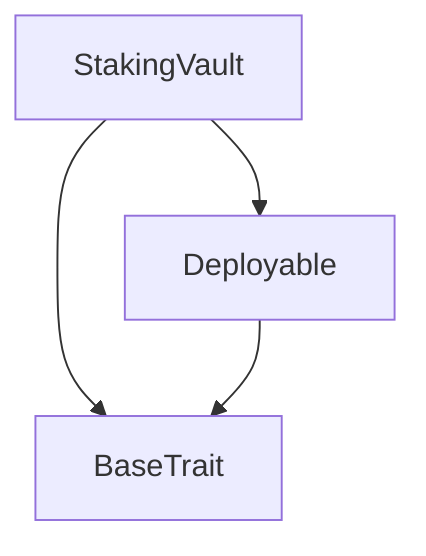
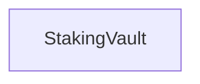

# Tact compilation report
Contract: StakingVault
BoC Size: 2971 bytes

## Structures (Structs and Messages)
Total structures: 25

### DataSize
TL-B: `_ cells:int257 bits:int257 refs:int257 = DataSize`
Signature: `DataSize{cells:int257,bits:int257,refs:int257}`

### SignedBundle
TL-B: `_ signature:fixed_bytes64 signedData:remainder<slice> = SignedBundle`
Signature: `SignedBundle{signature:fixed_bytes64,signedData:remainder<slice>}`

### StateInit
TL-B: `_ code:^cell data:^cell = StateInit`
Signature: `StateInit{code:^cell,data:^cell}`

### Context
TL-B: `_ bounceable:bool sender:address value:int257 raw:^slice = Context`
Signature: `Context{bounceable:bool,sender:address,value:int257,raw:^slice}`

### SendParameters
TL-B: `_ mode:int257 body:Maybe ^cell code:Maybe ^cell data:Maybe ^cell value:int257 to:address bounce:bool = SendParameters`
Signature: `SendParameters{mode:int257,body:Maybe ^cell,code:Maybe ^cell,data:Maybe ^cell,value:int257,to:address,bounce:bool}`

### MessageParameters
TL-B: `_ mode:int257 body:Maybe ^cell value:int257 to:address bounce:bool = MessageParameters`
Signature: `MessageParameters{mode:int257,body:Maybe ^cell,value:int257,to:address,bounce:bool}`

### DeployParameters
TL-B: `_ mode:int257 body:Maybe ^cell value:int257 bounce:bool init:StateInit{code:^cell,data:^cell} = DeployParameters`
Signature: `DeployParameters{mode:int257,body:Maybe ^cell,value:int257,bounce:bool,init:StateInit{code:^cell,data:^cell}}`

### StdAddress
TL-B: `_ workchain:int8 address:uint256 = StdAddress`
Signature: `StdAddress{workchain:int8,address:uint256}`

### VarAddress
TL-B: `_ workchain:int32 address:^slice = VarAddress`
Signature: `VarAddress{workchain:int32,address:^slice}`

### BasechainAddress
TL-B: `_ hash:Maybe int257 = BasechainAddress`
Signature: `BasechainAddress{hash:Maybe int257}`

### Deploy
TL-B: `deploy#946a98b6 queryId:uint64 = Deploy`
Signature: `Deploy{queryId:uint64}`

### DeployOk
TL-B: `deploy_ok#aff90f57 queryId:uint64 = DeployOk`
Signature: `DeployOk{queryId:uint64}`

### FactoryDeploy
TL-B: `factory_deploy#6d0ff13b queryId:uint64 cashback:address = FactoryDeploy`
Signature: `FactoryDeploy{queryId:uint64,cashback:address}`

### SetFee
TL-B: `set_fee#53465452 queryId:uint64 perValidatorFee:coins = SetFee`
Signature: `SetFee{queryId:uint64,perValidatorFee:coins}`

### Fund
TL-B: `fund#464e4456 queryId:uint64 = Fund`
Signature: `Fund{queryId:uint64}`

### Withdraw
TL-B: `withdraw#57445448 queryId:uint64 recipient:address amount:coins = Withdraw`
Signature: `Withdraw{queryId:uint64,recipient:address,amount:coins}`

### SetDepositor
TL-B: `set_depositor#53444550 queryId:uint64 depositor:address = SetDepositor`
Signature: `SetDepositor{queryId:uint64,depositor:address}`

### PauseBeaconDeposits
TL-B: `pause_beacon_deposits#50415553 queryId:uint64 = PauseBeaconDeposits`
Signature: `PauseBeaconDeposits{queryId:uint64}`

### ResumeBeaconDeposits
TL-B: `resume_beacon_deposits#5245534d queryId:uint64 = ResumeBeaconDeposits`
Signature: `ResumeBeaconDeposits{queryId:uint64}`

### DepositToBeacon
TL-B: `deposit_to_beacon#44425053 queryId:uint64 validatorsCount:uint16 totalAmount:coins = DepositToBeacon`
Signature: `DepositToBeacon{queryId:uint64,validatorsCount:uint16,totalAmount:coins}`

### RequestValidatorExit
TL-B: `request_validator_exit#52455854 queryId:uint64 validatorsCount:uint16 = RequestValidatorExit`
Signature: `RequestValidatorExit{queryId:uint64,validatorsCount:uint16}`

### TriggerValidatorWithdrawal
TL-B: `trigger_validator_withdrawal#54525744 queryId:uint64 validatorsCount:uint16 refundRecipient:address = TriggerValidatorWithdrawal`
Signature: `TriggerValidatorWithdrawal{queryId:uint64,validatorsCount:uint16,refundRecipient:address}`

### AdapterTriggerWithdrawal
TL-B: `adapter_trigger_withdrawal#41545057 queryId:uint64 validatorsCount:uint16 = AdapterTriggerWithdrawal`
Signature: `AdapterTriggerWithdrawal{queryId:uint64,validatorsCount:uint16}`

### AuthorizeUpgrade
TL-B: `authorize_upgrade#41555047 queryId:uint64 codeHash:uint256 = AuthorizeUpgrade`
Signature: `AuthorizeUpgrade{queryId:uint64,codeHash:uint256}`

### StakingVault$Data
TL-B: `_ owner:address nodeOperator:address depositor:address upgradeController:address withdrawalAdapter:address beaconChainDepositsPaused:bool ossified:bool version:uint16 withdrawalFeePerValidator:coins pendingQueryId:uint64 pendingFee:coins pendingRefundRecipient:address activeCodeHash:uint256 = StakingVault`
Signature: `StakingVault{owner:address,nodeOperator:address,depositor:address,upgradeController:address,withdrawalAdapter:address,beaconChainDepositsPaused:bool,ossified:bool,version:uint16,withdrawalFeePerValidator:coins,pendingQueryId:uint64,pendingFee:coins,pendingRefundRecipient:address,activeCodeHash:uint256}`

## Get methods
Total get methods: 10

## get_owner
No arguments

## get_node_operator
No arguments

## get_depositor
No arguments

## get_paused
No arguments

## get_ossified
No arguments

## get_withdrawal_fee_per_validator
No arguments

## get_active_code_hash
No arguments

## get_pending_query_id
No arguments

## get_pending_fee
No arguments

## calculate_validator_withdrawal_fee
Argument: keysCount

## Exit codes
* 2: Stack underflow
* 3: Stack overflow
* 4: Integer overflow
* 5: Integer out of expected range
* 6: Invalid opcode
* 7: Type check error
* 8: Cell overflow
* 9: Cell underflow
* 10: Dictionary error
* 11: 'Unknown' error
* 12: Fatal error
* 13: Out of gas error
* 14: Virtualization error
* 32: Action list is invalid
* 33: Action list is too long
* 34: Action is invalid or not supported
* 35: Invalid source address in outbound message
* 36: Invalid destination address in outbound message
* 37: Not enough Toncoin
* 38: Not enough extra currencies
* 39: Outbound message does not fit into a cell after rewriting
* 40: Cannot process a message
* 41: Library reference is null
* 42: Library change action error
* 43: Exceeded maximum number of cells in the library or the maximum depth of the Merkle tree
* 50: Account state size exceeded limits
* 128: Null reference exception
* 129: Invalid serialization prefix
* 130: Invalid incoming message
* 131: Constraints error
* 132: Access denied
* 133: Contract stopped
* 134: Invalid argument
* 135: Code of a contract was not found
* 136: Invalid standard address
* 138: Not a basechain address

## Trait inheritance diagram

## Contract dependency diagram

